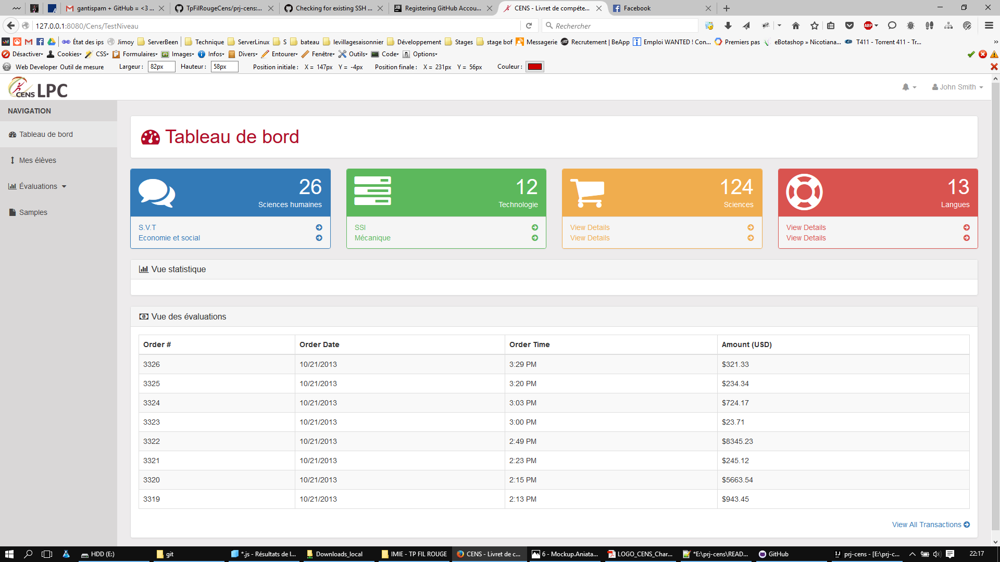
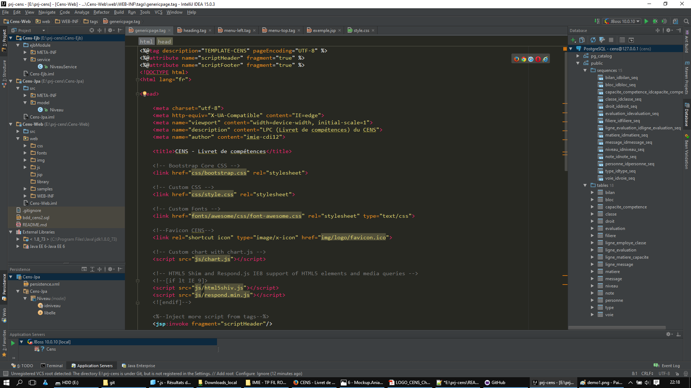

# prj-cens
<i>Projet fil rouge pour le Cens.</i>

<h2>DataBase :</h2>
<ul>
<li>Name : cens </li>
<li>User : postgres</li>
<li>Password : P@ssword</li>
<li>URL : jdbc:postgresql://127.0.0.1:5432/cens</li>
<li>Port : 5432</li>
<li>Driver.class : org.postgresql.Driver</li>
<li>Driver.version : postrgesql-9.4-1201.jdbc4</li>
</ul>

<h2>Server</h2>
<ul>
<li>Server : WildFly Jboss</li>
<li>Version : 10.0.1</li>
<li>Config. : see standalone.xml</li>
</ul>

<h2>App</h2>
<ul>
<li>IDE : IntelliJ iDEA 15 <small>(DEV. WITH INTELLIJ IDEA 15 64Bits for use last JRE) path : "C:\Program Files (x86)\JetBrains\IntelliJ IDEA 15.0.3\bin\idea64.exe"</small></li>
<li>JDK : Java 1.8.0_73 (for system environnement, app, IDEA and Wildfly</li>
<li>ORM :  JPA Hibernate 2.1</li>
<li>Class service : EJB</li>
<li>Front : Bootstrap</li>
<li>Chart : chart.js</li>
<li>Template : tags (JEE)</li>
<li>Artefact: 'Cens'</li>
<li>Demo : http://127.0.0.1:8080/Cens/TestNiveau</li>
</ul>

<h2>View : <h2/>

<h2>IntelliJ Environnement: <h2/>

